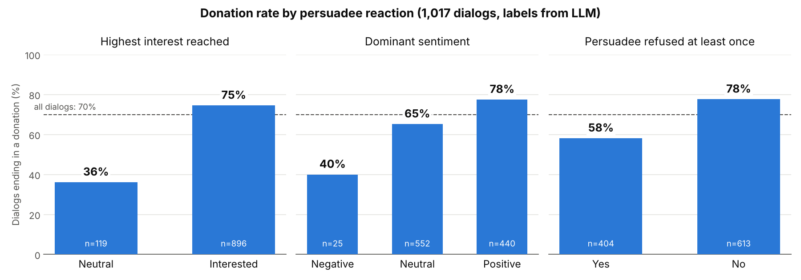
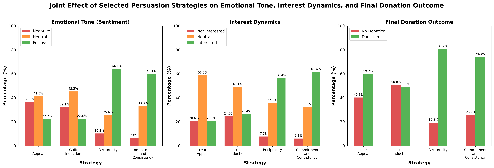
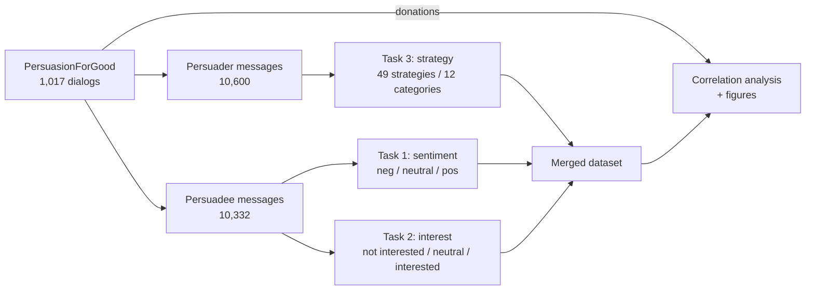

# What makes people donate? Persuasion strategies in charity dialogs

NLP analysis of **1,017 real persuasion conversations** from the
[PersuasionForGood](https://aclanthology.org/P19-1566/) corpus, where one person
tries to convince another to donate to a children's charity.
Using local LLMs, I labelled **~21,000 messages** with persuasion strategies,
sentiment and interest in donating, then measured which strategies and reactions
go together with an actual donation.



**Python · pandas · matplotlib · LLMs via Ollama (gpt-oss 20B, Qwen3 30B) · prompt engineering · Hugging Face Transformers (earlier iterations)**

## Key findings

* **Interest is the strongest signal.** Dialogs where the persuadee ever showed
  interest ended in a donation **75%** of the time, versus **36%** when they never
  got past neutral.
* **Tone matters.** Mostly positive conversations led to donations in **78%** of
  cases, mostly negative ones in **40%**.
* **A refusal is not the end.** Even after the persuadee said no at least once,
  **58%** of dialogs still ended in a donation (78% without a refusal).
* **Cooperative strategies beat pressure.** Messages using *Reciprocity* or
  *Commitment & Consistency* were followed by a positive reply about 60% of the
  time and sat in dialogs with a 74-81% donation rate. *Guilt Induction* and
  *Fear Appeal* drew a negative reply about a third of the time, and dialogs using
  them donated at only 49-60%.



All numbers are correlations over LLM-generated labels. See
[Limitations](#limitations).

## Approach



| Task | Question | How |
|---|---|---|
| **1. Sentiment** | Is the persuadee's tone negative, neutral or positive? | LLM labels every persuadee message, one request per dialog so it sees the whole conversation |
| **2. Interest** | Is the persuadee refusing, undecided or interested in donating? | Same batching; context is essential here (*"maybe later"* means different things in different dialogs) |
| **3. Strategy** | Which persuasion technique does each persuader message use? | Two-step prompt: pick 1 of 12 categories, then 1 of the strategies inside it. Custom taxonomy of 49 strategies with definitions, marker phrases and disambiguation rules |

The LLM pipeline is the fourth iteration. Before it I tried zero-shot NLI
(BART / RoBERTa-MNLI), a classifier on NLI features trained on 500 hand-labelled
messages, and a fine-tuned RoBERTa with dialog context, which struggled with the
rare *refusal* class. Details in [docs/methodology.md](docs/methodology.md).

## Results in numbers

| | |
|---|---|
| Dialogs / messages analysed | 1,017 / 20,932 |
| Dialogs ending in a donation | 711 (69.9%) |
| Persuader messages that received a strategy | 97.7% |
| Distinct strategies observed | 45 of 49 |
| Average distinct strategies per dialog | 7.5 |
| Persuadee messages: neutral / positive / negative | 47% / 44% / 9% |
| Persuadee messages: neutral / interested / not interested | 63% / 27% / 10% |

<details>
<summary><b>Donation rate per strategy</b> (persuasive strategies used at least 50 times)</summary>

Greetings, acknowledgements and other conversation-management moves are left out.

| Strategy | Category | Times used | Dialog ended in donation |
|---|---|---:|---:|
| Reciprocity | Exchange / Incentives | 88 | 80.7% |
| Unity | Social Influence | 50 | 80.0% |
| Activation of Personal Commitment | Commitment / Consistency | 86 | 79.1% |
| Pre-giving | Exchange / Incentives | 55 | 76.4% |
| Commitment and Consistency | Commitment / Consistency | 226 | 74.3% |
| Storytelling | Emotional Influence | 177 | 73.4% |
| Appeal to Values | Norms / Morality / Values | 536 | 72.2% |
| Empathy Appeal | Emotional Influence | 264 | 71.2% |
| Social Proof | Social Influence | 182 | 70.3% |
| Rational Appeal | Rational / Impact Appeal | 879 | 70.0% |
| Framing | Framing & Presentation | 730 | 66.8% |
| Self-feeling Appeal | Norms / Morality / Values | 125 | 66.4% |
| Moral Appeal | Norms / Morality / Values | 520 | 66.2% |
| Credibility Appeal | Authority / Expertise | 674 | 66.0% |
| Call to Action | Call to Action | 573 | 66.0% |
| Emotional Appeal | Emotional Influence | 73 | 65.8% |
| Fear Appeal | Emotional Influence | 72 | 59.7% |
| Rewarding Activity | Exchange / Incentives | 65 | 52.3% |
| Guilt Induction | Norms / Morality / Values | 128 | 49.2% |

Full table: [`results/strategy_donation_stats.csv`](results/strategy_donation_stats.csv)
</details>

More plots are in [`figures/`](figures/), for example
[strategy distribution](figures/task3_single_analysis.png),
[strategy × donation heatmap](figures/strategy_donation_heatmap.png) and
[interest over the course of a dialog](figures/interest_v2_analysis.png).

## Repository structure

```
├── src/
│   ├── classification/        # LLM labelling (needs an Ollama server)
│   │   ├── llama_sentiment.py         Task 1
│   │   ├── llama_interest.py          Task 2
│   │   ├── llama_strategies.py        Task 3
│   │   └── strategies_hierarchical.py strategy taxonomy (49 strategies, 12 categories)
│   ├── analysis/              # statistics and plots from the labels
│   └── paths.py               # all file locations in one place
├── data/
│   ├── processed/full_dialog_with_all_analysis.csv   every message with all labels
│   └── README.md              # data source, columns, how to get the raw corpus
├── results/                   # summary tables (CSV)
├── figures/                   # plots (PNG)
├── docs/
│   ├── methodology.md         # how labels were produced, iterations, limitations
│   ├── strategies_sources.md  # literature behind the strategy taxonomy
│   └── dev-notes/             # original working notes (in Russian)
└── archive/early_runs/        # outputs of earlier runs, kept for reference
```

## Running it

```bash
git clone https://github.com/mlproef/donation-persuasion-nlp.git
cd donation-persuasion-nlp
python -m venv venv && source venv/bin/activate   # Windows: venv\Scripts\activate
pip install -r requirements.txt
```

**Explore the results** without running anything: open
`data/processed/full_dialog_with_all_analysis.csv` or the files in `results/`.

**Re-run the analysis:** download `full_dialog.csv` and `full_info.csv` into
`data/raw/` (see [data/README.md](data/README.md)), then:

```bash
# 1. Label the messages (slow; needs Ollama with the models pulled)
export OLLAMA_URL=http://localhost:11434/api/chat
python src/classification/llama_sentiment.py
python src/classification/llama_interest.py
python src/classification/llama_strategies.py

# 2. Merge, compute statistics, draw figures
python src/analysis/merge_all_analysis_results.py
python src/analysis/analyze_donation_dataset.py
python src/analysis/analyze_interest_donation_correlation.py
python src/analysis/analyze_strategy_donation_correlation.py
python src/analysis/analyze_joint_strategies_effect.py
python src/analysis/make_key_findings_figure.py
```

Each script can be run from any directory; paths resolve through `src/paths.py`.

## Limitations

* **LLM labels are not yet validated against human annotation.** Measuring
  agreement on the 500 hand-labelled messages from an earlier iteration is the
  next step.
* **Correlation, not causation.** Persuaders adapt their strategy to how the
  conversation is going, so a strategy seen in successful dialogs did not
  necessarily cause the donation.
* **Rare strategies.** Several strategies occur fewer than 20 times; their
  rates are not reliable.
* **Donation outcome** counts a dialog as successful if either participant
  donated, which includes the persuader's own donation.

## Data and credits

Dialogs and donation amounts: PersuasionForGood corpus by Wang et al., *Persuasion
for Good: Towards a Personalized Persuasive Dialogue System for Social Good*,
ACL 2019, released under the Apache License 2.0.

Built as a Bachelor Semester Project by [@mlproef](https://github.com/mlproef).
